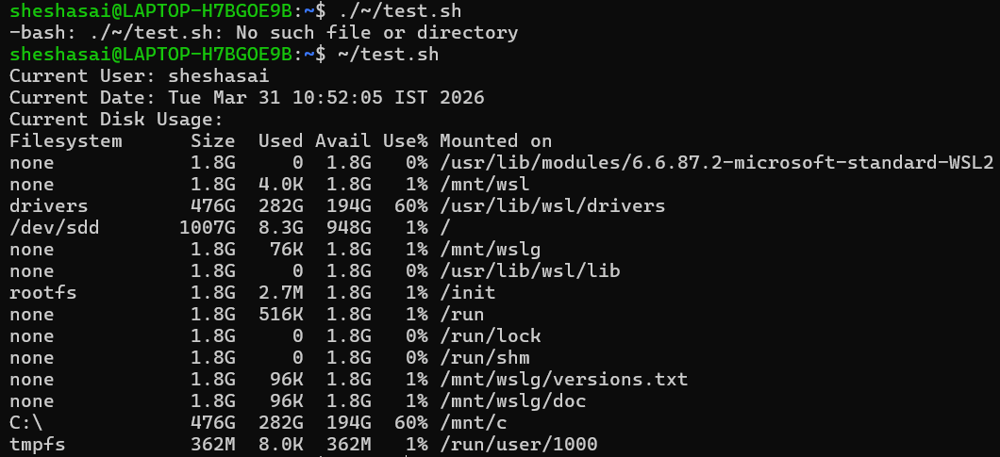
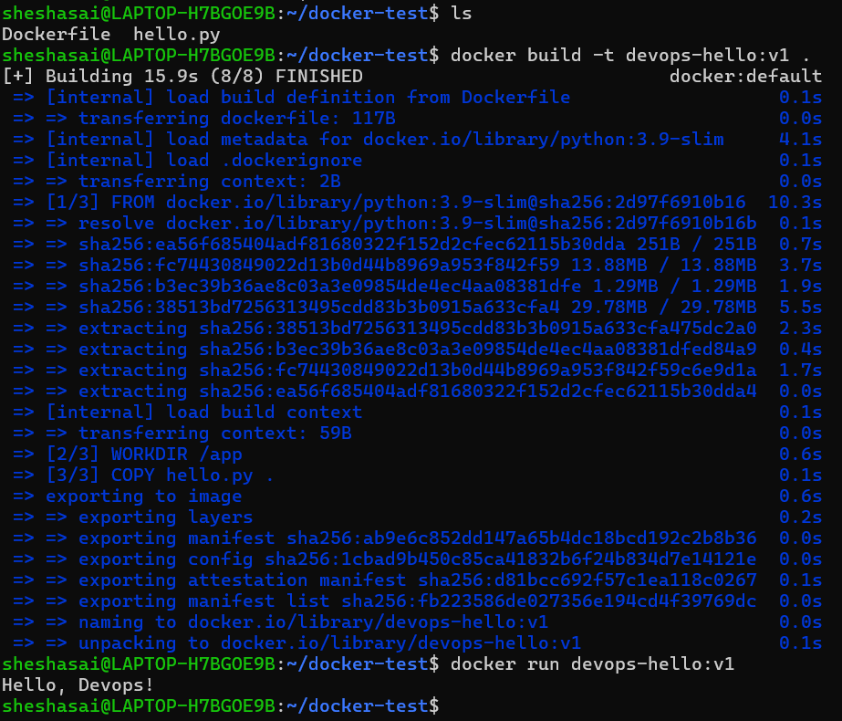

# DEVOPS ASSIGNMENT
This project repo demonstrates basic scripts and actions of Linux, GitHub, Docker, CI/CD, Nomad, monitoring with step by step procedure.

# 1. Linux & Scripting Basics
Basic Linux commands automated through bash script

NOTE: Ensure Ubuntu installed, either virtualbox or wsl 
- Current User
- Current Date
- Disk usage of the system
1. **Provide Execute Permissions to the file**
   ```bash
   chmod -x sysinfo.sh
   ```
2. **Run the file**
   ```bash
   ~/scripts/sysinfo.sh
   ```

   


# 2. Docker Basics
Install docker

1. **Start docker:**
   ```bash
   sudo systemctl enable --now docker
   ``` 
2. **Verify Installation: (Must print hello-world)**
   ```bash
   sudo docker run hello-world
   ```
3. **Create a Separate Folder, inside - one for docker - other for python, use the file provided in /scripts/docker-test/Dockerfile , hello.py**

4. **Build Docker Image:**
    ```bash
    docker build -t devops-hello:v1 .
    ```
5. **Run the container:**
    ```bash
    docker run devops-hello:v1
    ```
#### Output:
    It runs the python script and prints the output "Hello, DevOps!"

# 3. CI/CD with Github Actions
## DevOps Hello World

A simple Python script that prints "Hello, DevOps!" with automated CI/CD using GitHub Actions.

### CI/CD Status


### Run Locally
```bash
python hello.py
```

# 4. Job Deployment with Nomad


## Prerequisites
- Nomad installed locally (https://www.nomadproject.io/downloads)
- Docker installed and running
- The `devops-hello:v1` Docker image built

## Steps to Run

1. **Build the Docker image** (if not already done):
   ```bash
   docker build -t devops-hello:v1 .
   ```
2. **Run the Nomad Job**
   ```bash
   nomad job run nomad/hello.nomad
   ```

3. **Check job status:**

   ```bash
   nomad job status devops-hello
   ```
4. **Stop the job (when done):**
   ```bash
   nomad job stop devops-hello
   ```

# 5. Monitoring with Grafana Loki

## Overview
This project uses Grafana Loki for log aggregation and monitoring. Loki collects logs from Docker containers and Nomad jobs, making them searchable and viewable through Grafana.

## Setup Instructions
See [`monitoring/loki_setup.txt`](./monitoring/loki_setup.txt) for complete setup commands and configuration.

## Quick Start

1. **Start Loki stack**:
   ```bash
   docker network create loki-net
   docker run -d --name loki --network loki-net -p 3100:3100 grafana/loki:latest -config.file=/etc/loki/local-config.yaml
   docker run -d --name promtail --network loki-net -v /var/lib/docker/containers:/var/lib/docker/containers:ro -v /var/run/docker.sock:/var/run/docker.sock grafana/promtail:latest
   docker run -d --name grafana --network loki-net -p 3000:3000 grafana/grafana:latest
   ```
2. **Log Viewing Comands:**
  ```bash
  docker logs devops-hello

  curl -G 'http://localhost:3100/loki/api/v1/query' \
  --data-urlencode 'query={container_name="devops-hello"}' \
  --data-urlencode 'limit=10'
  ```

  # Conclusion
  This Project successfully demonstrates the basic utilization of tools and workflow used in DevOps.

  **Author: Shesha Sai Geethri**